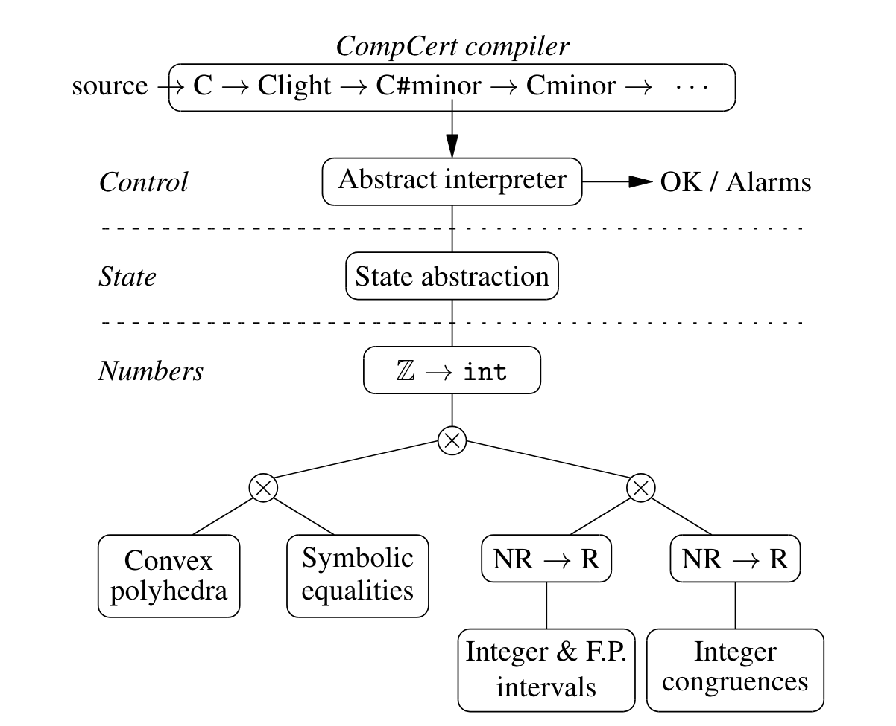

# A formally-verified C static analyzer: Verasco
- Verasco establishes the absense of run-time errors in the analyzed programs. 
- It integrates with the CompCert formally-verified C compiler so that not only the soundness of the analysis results is guaranteed with mathematical certificate, but also the fact that these guarantees carry over to the compiled code. 
- Verasco is based on abstract interpretation and is entirely proved to be sound using the Coq proof assistant.
- Focuses on static analysis for low-level language like C that establish the absence of run-time errors such as out-of-bound array accesses, null pointer dereferences, and arithmetic exceptions.

## Overview of Verasco:

- At the top sits the abstract interpreter that infers abstract states at every program point and checks for potential run-time errors, raising alarm along the way. 
- The abstract interpreter operates over the C#minor intermediate language (the second intermediate language in CompCert).
    - C#minor is deterministic (picks one evaluation order) and modeled as small-step semantics.
    - Local variables of scalar types whose addresses are never taken are "pulled out of memory" and turned into temporaries.
    - All type-dependent behaviors are made explicit.  
        - Operator overloading is resolved 
        - Implicit conversion is materialized 
        - Array and struct accesses become load and store operation with explicit address computation
        - C loops are encodes using block and exit. 
- Verasco reuses the CompCert frontend to produce C#minor from the flull-fledge C language.
- The semantic preservation theorem of CompCert guarantees that any safety property established on the C#minor intermediate language carries over to the assembly code generated by CompCert. 
- Combining CompCert's semantic preservation along with the soundness proof of Verasco, we obtain that any C#minor program that passes analysis without raising an alarm compiles to assembly code that is free of run-time errors.
- The middle layer of Verasco is an abstract domain for execution states, tracking the values of program variables, the contents of memory locations, and the chain of function calls. 
    - Each upper lower is parameterized by the lower level paramters like abstract state, abstract information about numbers, etc.
