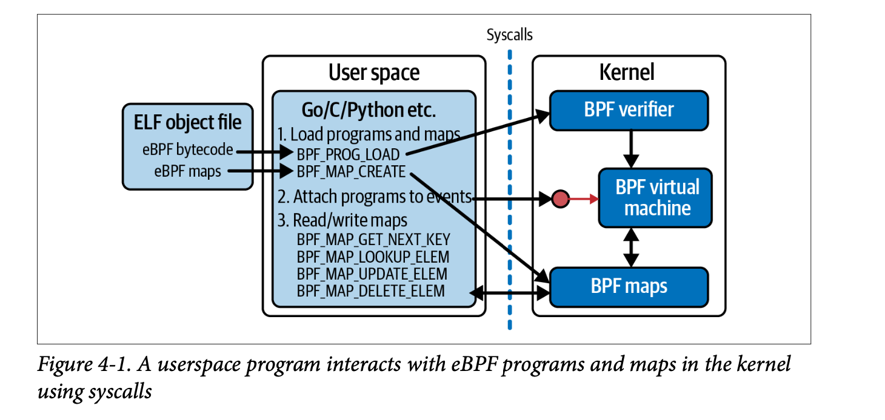

# bpf() syscalls
- eBPF programs running in the kernel does not require syscalls to access the maps or kernel features, but the programs running in the user space requires syscalls to interact with the kernel.
- ```
  int bpf(int cmd, union bpf_attr *attr, unsigned int size)
  ```
    bpf() is used to perform a command on an extended BPF map or program. 

    - cmd: command specifies the actions
    - attr: holds whatever data is needed to specify the parameters for the command
    - size: indicates how many bytes of data there are in attr
- Example of traditional syscall (```strace ls```):
  - ```read(3, "nodev\tsysfs\nnodev\ttmpfs\nnodev\tbd"..., 1024) = 393```
    + read is a syscall here. 3 which specify the file descriptor. Next argument is output buffer and 1024 represents the size of the output buffer. It returns 393 specifying the size that the ```read``` syscall reads from the file ```3```



- bpf() syscall example:
  - **Creating a hash table**
    ```
    bpf(BPF_MAP_CREATE, {map_type=BPF_MAP_TYPE_HASH, key_size=4, value_size=12, max_entries=10240... map_name="config", ...btf_fd=3, ...}, 128) = 5
    ```
      + command: BPF_MAP_CREATE which creates the config map hash table
      + attr: map_type is BPF_MAP_TYPE_HASH, key size of the map is 4 etc...
      + 128: size of data in attributes
      + 5: A file descriptor that can be used to refer to this config map
  
  - **Loading a program**
    ```
    bpf(BPF_PROG_LOAD, {map_type=BPF_PROG_TYPE_KPROBE, inst_cnt=44, 
    insns=0xffffa836abe8, license="GPL", ..., prog_name="hello", ...,
    expected_attach_type= BPF_CGROUP_INET_INGRESS, prog_btf_fd=3,...
    }, 128) = 6
    ```
    - coomand: BPF_PROG_LOAD 
    - attar: 
      - prog_type : program type, which here indicates that it's intended to be attached to a kprobe.
      - inst_cnt : instruction count. Number of bytecode instructions in the program
      - insns: address holding the bytecode instructions
      - program name: hello

- **Verification for this syscall:**
  - If the verification fails, then these bpf() syscalls returns a negative value.

- **Insights**
  - Loading a BPF program into the kernel with the ```bpf()``` syscall returns a file descriptor. (as seen in the two examples above)
  - Withing the kernel, this file descriptor is a reference to the program.
  - The user space program that made the syscall owns this file descriptor;
    when the process exits, the file descriptor gets released and the reference count to the program is decremented. When there is no reference left to a BPF program, the kernel removes the program.
  - When a program is attached to a hook, its reference counter is incremented. The user space process that created the maps and program can then exit, and the maps and program will remain alive as long as their reference counters are greater than zero. This is the lifecycle of a BPF object.

