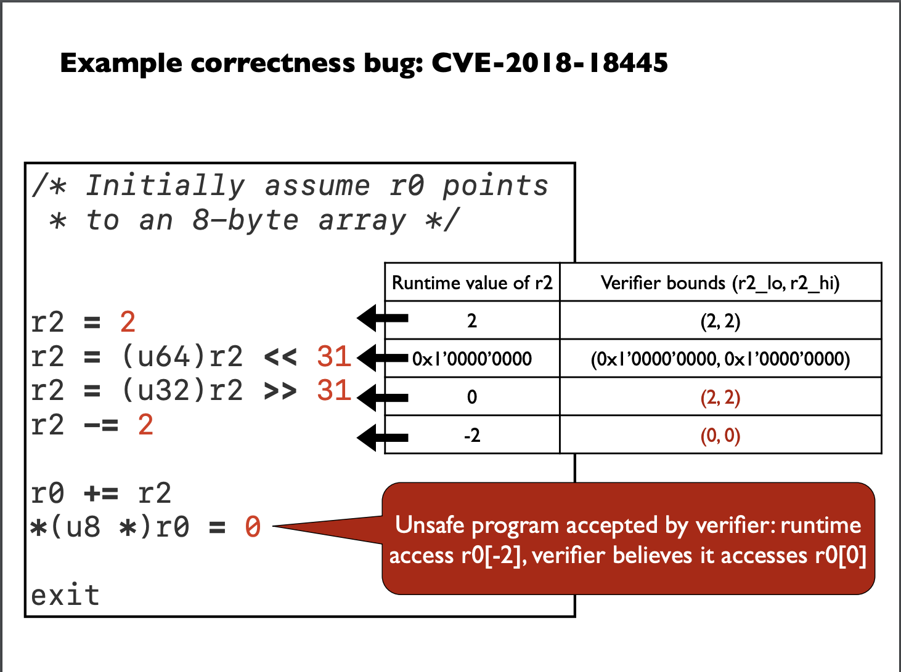
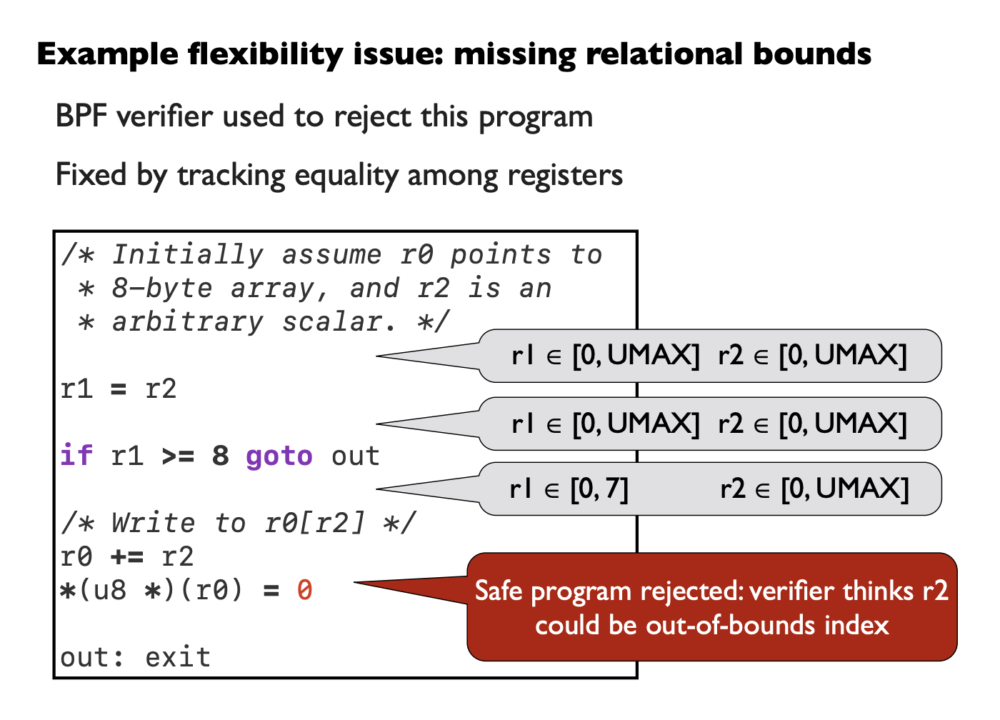

# Drawbacks of eBPF verifier:
- Reasoning about verifier correctness is non-trivial.
- Missing support of mitigation against timing-attacks
- State explosion issue.
- Verifier only work on the bytecode, hence no guarantee for the machine code. 
- False positives. Disconnect between the various kind of optimizations performed by LLVM and it might reject valid programs 
- Stable ABI: An upgrade in OS kernel - How it can be linked with the current state of eBPF verifier? 
- Tradeoff between efficiency and security.
- eBPF programs use a range of helper functions that are not verified. 
- Growing complexity of the verifier
- Buggy verifier: 
    - Allow unsafe programs to perform illegal read/write.
    - Kernel pointer leaks.
    - Privilege escaltion.
- Verification is expensive

# Verifier bugs
- The verifier analyzes the semantics of some instructions in a wrong way.      
  - An example is pointed out in the paper "A proof-carrying approach to building correct and flexible BPF verifiers" about the left and right shift operator involving truncation. It was correctness bug. The actual operation was truncation followed by shift and the verifier was analyzing the shift followed by truncation.
  
- Another example pointer out in the paper "A proof-carrying approach to building correct and flexible BPF verifiers" related to flexibility issue.
  - The verifier use to verify the upper and lower bound of each register but was not capturing the relation between the registers.
  
