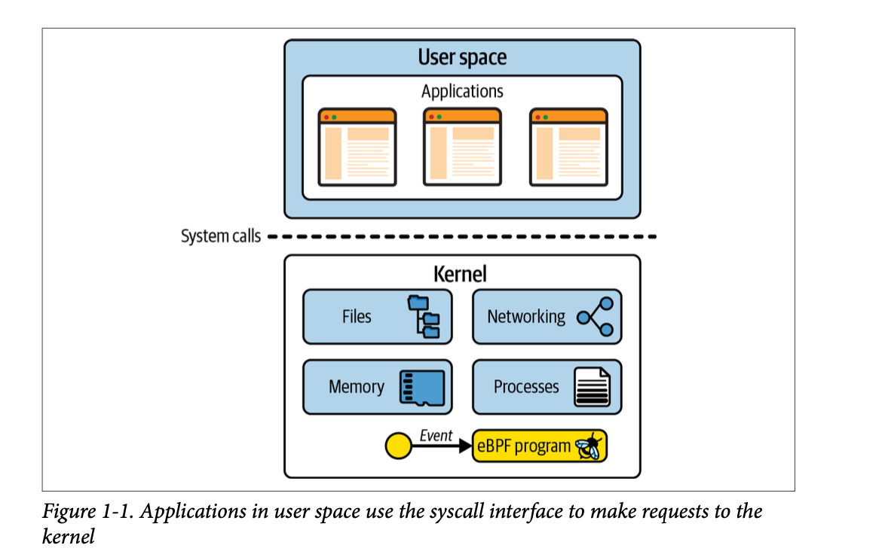

# Introduction 

- eBPF is a technology used with origins in Linux kernel that can run sandboxed programs in privileged contexts such as operating system kernel.
- It can be used to safely and efficiently extend the kernel's capabilities without requiring to change the kernel source code.
  Here is a pictorial representation describing the difference between the user and the kernel space. 

The Linux kernel is a layer between the software and the hardware. The developers write an application that runs in the user space and is not allowed to access the hardware directly. Instead, the application makes a request using the system call interface to request the kernel to act on its behalf.
- It allows the sandboxed programs to run within the operating system. The application developers can run eBPF programs to add extra functionality to the operating system at runtime.
  The operating system then provides the security and efficiency as if natively compiled with Just-In-Time compiler and verification engines. 
- eBPF programs can be written by developers that can be dynamically loaded at runtime to change the kernel's functionality.
- eBPF programs can be considered as a restricted subset of C programs.
- One very simple use case of eBPF is: that a program written in user space using eBPF can help filter the network packet received.
  
## Why eBPF? 
(1) A kernel developer can for sure make changes in the kernel code to add new functionality or to change the existing functionality. But the issue is not just about coding the changes, it should be accepted by the Linux community as it is a general-purpose operating system used by trillions of people for various purposes.

(2) Linux kernel also supports features of kernel modules where a developer can write kernel modules to add new features or change the existing ones. The advantage is it should not be incorporated into the mainstream Linux kernel. But still, the drawback the developer needs to do full-on kernel-level programming. If these modules lead to kernel crashing, it is a hectic job to fix everything. The concern about running a kernel module is ensuring it is safe to run. The kernel is responsible for the safety. For example, is the kernel module safe from various security attacks? Can we trust the author of the module to not add malicious code to the kernel through these modules?

### Advantages of eBPF:
* eBPF provides an additional benefit called "eBPF verifier" along with means to add features to kernel level from user-space. The job of 
  "eBPF verifier" is to ensure that the eBPF program is only executed at the kernel level if it is safe to run. It won't crash the kernel, 
  or make the kernel code loop forever, and it won't allow the data to be compromised.
* eBPF programs are loaded or removed dynamically from the kernel. Once they are attached to an event, they will be triggered by the event 
  irrespective of what caused that event. For example, if we attach a program to a syscall for opening files, it will be triggered whenever
  a process is trying to open a file. It does not matter whether the process was already running when the program was loaded. It is a huge
  advantage in terms of performance as the kernel does not have to reboot for the machine to use every new functionality.
* eBPF programs are very efficient. The program just needs to be loaded and it is then compiled by JIT directly to the machine code that is 
  executed on the CPU. There is no extra preformation cost for transitioning between the user space and kernel space to handle each event.

