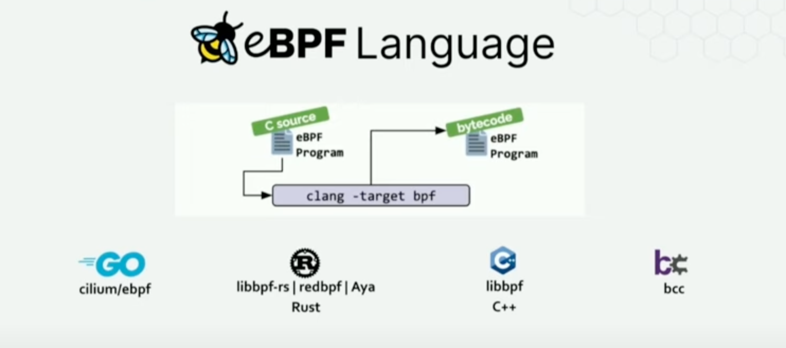
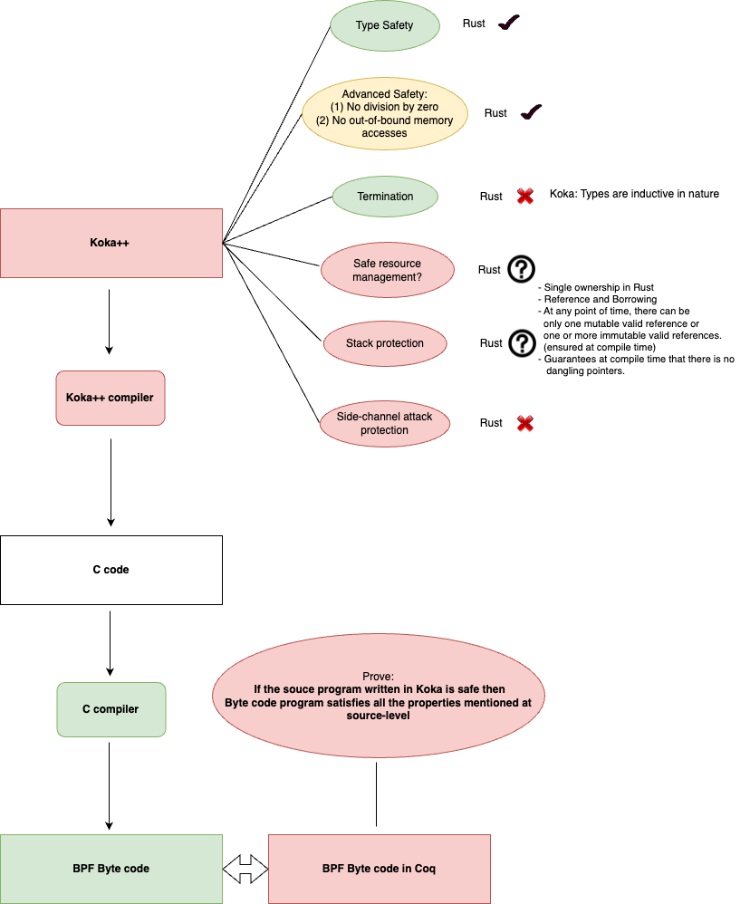

# Project overview
(1) Add a new source-level language to write eBPF program called koka++. 







## Property preservation by byte-code

## Approach 1: 
### Specification language:
- We need a specification language to specify the properties of interest.
  - DIV x y : 
    - Specification: y != 0, no overflow in case of signed division (-128/-1 = 128 leads to overflow in 8 bits.) (**Disallow division by zero**)
  - MOD x y:
    - Specification: y != 0, no overflow in case of signed division (-128/-1 = 128 leads to overflow in 8 bits.) (**Disallow division by zero**)
  - LOAD addr:
    - Specifications: addr ahouls be aligned, addr should be valid and in range. (**Disallow out of bound memory access**)

- Safety condition generator:
  - **Generate_safety_cond(BI) = {s1, s2, ..., sn}**, where BI is an byte-code instruction and si is the safety condition.
  
### Semantic and Proof language:
- If a BPF bytecode program meets the specification then it will always reach an ```ok``` state.
- Formalize the execution of BPF Bytecode programs as state machines.
  - Single step execution (For one BI instruction)
  - Multi step execution (For a sequence of BI instruction)
- **Sem(P), st --> st'**, where P is a sequence of BI and st represents the state which can be ```ok``` or ```error```
- Proof
  - **BI |= s ->
    Sem(BI), st --> ok st'** (Single step rule)
    
    - Example: In case of division operation, the semantic will only reach the ```ok``` state if the divisor is non-zero and result should not overflow in case of signed division (**BI |= s**). 
  - **P |= s ->
    Sem(P), st --> ok st'** (Multi step rule, which can be proved using indution hypothesis)
- **A safe BPF byte code program never gets to a stuck/error state.**

### Proof checker:
- Any safe BPF bytecode program written in this language will never reach a stuck state.
- One way is to manually prove each program written in the language specified above.
- Use symbolic execution/abstract interpretation to generate the proof.
- Then we validate the proof.

### Note
- Prior work "Exoverifer" and "Jitterbug" already implements this approach in Lean

## Approach 2:
### Bisimulation mechanism: 

### Specification language for both Koka++ and BPF Bytecoce:

  - We need a specification language at the Koka++ level (source level)
    - Formalizing Koka++
    - Formalizing the type system and specification language for Koka++
    - ```
      P_koka++ |- ty ->
      P_koka++ |= s ->
      exists st', Sem(P_koka++), st --> ok st' 
      ```
      The above theorem ensures safety of Koka++ language, let it be called as **safe(P_koka++)**.

### Semantics and Proof language: 
- We need a language at the BPF bytecode level to specify the semantics and syntax.
- A notion of specifications at bytecode level specifying what is meant by **safe(P_BPFBC)**
    - Will be like what is explained in approach 1.
      - Define the type system at BPF bytecode level
      - Define the safety condition generator at the BPF bytecode level
- 
  ```
   safe(P_koka++) ->
   safe(P_BPFBC)
  ```

- Write the verifier/type-system/safety-checker in Coq which act like a push button. 
  - **Verifier(P_BPFBC) = true/false** and **Verifier(P_koka++) = true/false**
  - Prove the correctness of the verifier once and forall
    ```
    Verifier(P_koka++)= true ->
    safe(P_koka++)
    ```
    ```
    Verifier(P_BPFBC)= true ->
    safe(P_BPFBC)
    ```

### Advantages of approach 2 as compared to approach 1
- This guarantees stronger tool support at the source level, which might help the programmer to write and debug eBPF programs more neatly as compared to debugging at bytecode level.
- Stronger guarantees than existing approach at compile time.
- Formally verified type system and safety checker for its correctness and soundness
- End-to-end guarantees from source to bytecode level.

## Useful references for bytecode formalization:

- [BPF virtual machine in Rust](https://github.com/qmonnet/rbpf)
- [Exoverifier](https://github.com/uw-unsat/exoverifier)
- [BPF and XDP Reference Guide BPF Architecture: Cilium](https://docs.cilium.io/en/stable/bpf/architecture/#instruction-set)
- [BPF standard documentation](https://github.com/ietf-wg-bpf/ebpf-docs)
- [Jitterbug](https://github.com/uw-unsat/jitterbug)