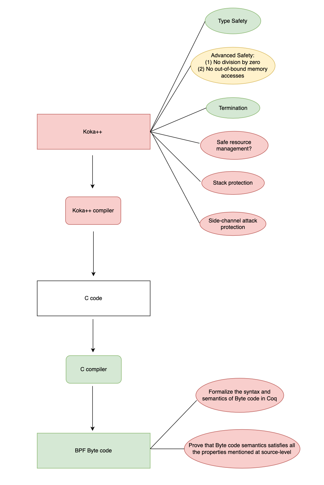

# Project overview

Useful references for bytecode formalization:

- [BPF virtual machine in Rust](https://github.com/qmonnet/rbpf)
- [BPF virtual machine in Lean](https://github.com/uw-unsat/exoverifier)
- [BPF and XDP Reference Guide BPF Architecture: Cilium](https://docs.cilium.io/en/stable/bpf/architecture/#instruction-set)
- [BPF standard documentation](https://github.com/ietf-wg-bpf/ebpf-docs)