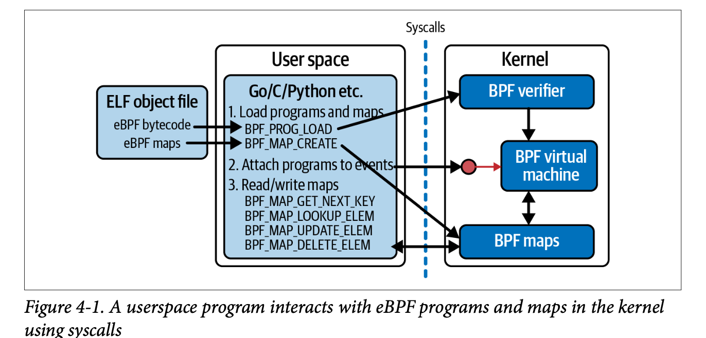

# Maps
- Maps provide a way for eBPF programs to communicate with each other (kernel space) and also with the user space programs.
- Maps are generic key/value store. There are different kinds of maps.
    - Array maps: The key type is always an int
    - Hash maps: The key type can be any arbitrary type 
    
- We have seen in various examples that how a user space programs (written using libbpf library or bpftool)is used to load an eBPF program into the kernel, attach it to an event and finally execute it. But to see the output/gather information about it, we often rely on these mechanism:
    - bpf_pritnk : Mainly used for debugging purposes. Prints the debug message to the tracepipe. It is not possible to differentiate which message is printed through which process.
    - BPF maps : BPF maps are useful when we want to deal with information of various types. It can be also useful when various eBPF programs are enquiring about some shared information (this information can be stored in the maps). It can be also useful when the information needs to be shared between the user space and kernel space. 
    - perf events : TODO
- When both user space and kernel space access the same maps, they both need an understanding about the key and value structures in the memory. This can work if both the user space and kernel space programs accessing the maps are written in C and they share the header. Or there must be some means to transfer the information about map structure in a consistent manner to both user space and kernel space. 
- Usecases of maps:
    - An eBPF program writing results or metrics into a map, which can be retrieved from the user space.
    - An eBPF program can store some metadata information about the state of the program that can be used by other eBPF program or the same program.
    - A user space program can write some configuration information that can be used by the eBPF program.

## Defining maps in eBPF programs
- When we want to use maps in eBPF programs, we need to define them in our program.

### Legacy way of defining maps:
- Map definitions were done defining a ```struct bpf_map_def``` with an elf ```section __attribute__``` ```SEC("maps")```, which contains various fields like type of map, size of key and value, maximum entries allowed in a map, and flags showcasing some specific properties. 
```
struct bpf_map_def {
      unsigned int type;
      unsigned int key_size;
      unsigned int value_size;
      unsigned int max_entries;
      unsigned int map_flags;
};

struct bpf_map_def SEC("maps") my_map = {
      .type        = BPF_MAP_TYPE_XXX,
      .key_size    = sizeof(u32),
      .value_size  = sizeof(u64),
      .max_entries = 42,
      .map_flags   = 0
};
```

### Current way of defining maps:
- It relies on BTF type format to describe mandatory and optional attributes of the map.
- All maps need to be defined in ```.maps``` elf section.
- These maps needs to be located in ```.maps``` section for loaders to determine the metadata like map type, key and value type. 
- A map declaration and initilization is done through a global/static variable of struct type with few mandatory and few optional fields.
```
struct my_value { int x, y, z; };

struct {
    __uint(type, BPF_MAP_TYPE_ARRAY);
    __type(key, int);
    __type(value, struct my_value);
    __uint(max_entries, 16);
} my_map SEC(".maps");
```
- May type, key and value type, max entries type should be a ```pointer``` to the type describing the corresponding metadata. This is done to save excessive amounts of space allocated in
   corresponding ELF sections for key/value of big size.
 
- ```__uint, __type``` are macros: [https://elixir.bootlin.com/linux/v6.2.2/source/tools/lib/bpf/bpf_helpers.h]
```
#define __uint(name, val) int (*name)[val]
#define __type(name, val) typeof(val) *name
#define __array(name, val) typeof(val) *name[]
```
- The name part of these macros refers to field names of the to be created structure. For example, in the above case it is ```type```, ```key```, ```value```, and ```max_entries```

- Maps are declared in the eBPF programs (as seen in the program [https://github.com/swarnpriya/eBPF_notes/blob/main/eBPF_Koka/bpf_maps/hash_map_example.bpf.c]), but they are ultimately created from the userspace.
- Most loader libraries pick up the map declarations from the compiled ELF file and create them automatically for the user.
- However, it is also possible for users to manually create maps using the BPF_MAP_CREATE command of the BPF syscall or to use a loader library with such capabilities. (create maps during runtime)
    ```
    LIBBPF_API int bpf_map_create(enum bpf_map_type map_type,
                    const char *map_name,
                    __u32 key_size,
                    __u32 value_size,
                    __u32 max_entries,
                    const struct bpf_map_create_opts *opts);
    ```
    ```
    bpf(BPF_MAP_CREATE, &bpf_attr, sizeof(bpf_attr));
    ```

### Maps accessibility from kernel and user space

#### From kernel space:
- eBPF functions can interact with maps using helper functions.
- Depending on the type of map, there can be different kind of helper functions that provides various functionalities for accessing the maps.
- There are some generic helper functions for all kinds of maps:
    - bpf_map_lookup_elem
    - bpf_map_update_elem
    - bpf_map_delete_elem
    - bpf_for_each_map_elem
- Some specilized helper functions for maps:
    - bpf_redirect_map (performs packet redirection based on the content of the map)

#### From user space:
- There are some generic functions (also called commands) also available in the user space to access maps:
    - BPF_MAP_LOOKUP_ELEM
    - BPF_MAP_UPDATE_ELEM
    - BPF_MAP_DELETE_ELEM
    - BPF_MAP_GET_NEXT_KEY 
    - ...
- There are also commands in user space to access the data in batches from the map:
    - BPF_MAP_LOOKUP_BATCH
    - BPF_MAP_UPDATE_BATCH
    - BPF_MAP_DELETE_BATCH

### Some imp points:
- Maps are declared in eBPF programs (kernel space) and uses helper functions to access the map. 
- From the user space, maps can be accessed through bpf_calls (syscalls : bpf()). The syscall interface is only used by the user space programs.



## References:
- [https://ebpf-docs.dylanreimerink.nl/linux/concepts/maps/]
- [https://prototype-kernel.readthedocs.io/en/latest/bpf/ebpf_maps.html]
- [https://www.tigera.io/learn/guides/ebpf/]